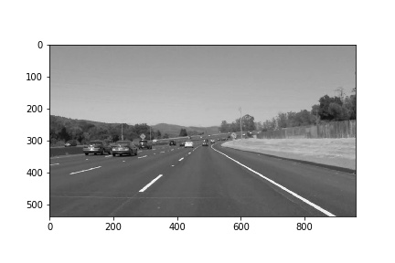
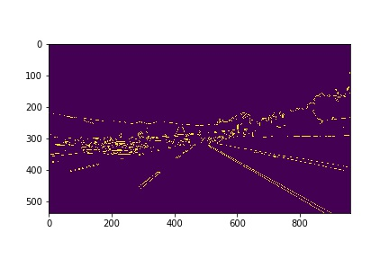
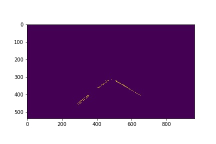
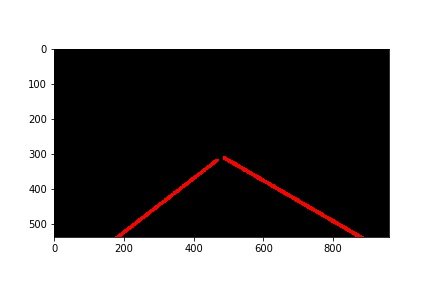
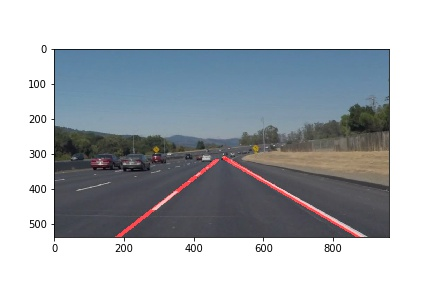

# **Finding Lane Lines on the Road**

---

**Finding Lane Lines on the Road**

The goals / steps of this project are the following:
* Make a pipeline that finds lane lines on the road
* Reflect on your work in a written report

---

### Reflection

### 1. Describe your pipeline. As part of the description, explain how you modified the draw_lines() function.

My pipeline consisted of 5 steps.
* Convert the image to grayscale using the `grayscale` helper function

* Apply Gaussian smoothing on the image using `gaussian_blur`

* Detect edges in the image using `canny`

* Mask edges outside the likely lane line polygon footprint by using `region_of_interest`

* Detect lines from the edge-located pixels using `hough_lines`
  * The `draw_lines` function was modified to draw only two straight lines representative of the full extent of the lane lines (see below)

* Overlay lines onto original image using `weighted_img`

In order to draw a single line on the left and right lanes, I had to modify the draw_lines() function. Now it iterates over all detected lines from the `cv2.HoughLinesP` function and does the following:
* Calculate the slope and determine if it's likely part of the right lane boundary or the left lane boundary. I estimated that lines with an absolute slope less than 0.25 were too horizontal and likely not lane lines. Above that threshold, the sign of the slope determined if the line was a right boundary or left boundary.
* Adjust the `anchor point` for either the right or left boundary if appropriate, which is the highest point on a detected line in the masked image (distant terminus of the eventual detected line)
* Increment the collection of x-values and y-values of detected points on lines for either the right or left boundary.

Then I used `np.polyfit` with a degree of 1 to fit the best line to the collection of points for each boundary. Given the anchor point and slope, that fully defined the extent of the likely lane line.

### 2. Identify potential shortcomings with your current pipeline

One shortcoming may arise if the shape of the road necessitated a different making polygon than what I defined. This could also easily happen due to lateral drift of the car within the lane.

Another shortcoming could arise when the road surface changes color abruptly, which might happen over a bridge or on heavily-patched segments. Then the edge detector may see edges that are not lane lines.

The quality of lane detection is also very sensitive to the Hough transform parameters. If, for instance, the dashed lines were shorter, I'd have to reduce the `threshold` parameter. Different ambient/camera conditions could also require adjustments to these parameters.

### 3. Suggest possible improvements to your pipeline

One way to improve things would be to base the masked region on the detected line positions from the previous image. We can say with reasonable confidence that the lines in one frame are geometrically similar to those in the previous frame, so we can use a much more aggressive mask for reducing noise and improving performance.

Another potential improvement could be to weight the contributions of the raw `HoughLinesP` output lines according to their length. Not only are longer lines more reliable, but they're more likely to be close to the vehicle and therefore more relevant to vehicle control
